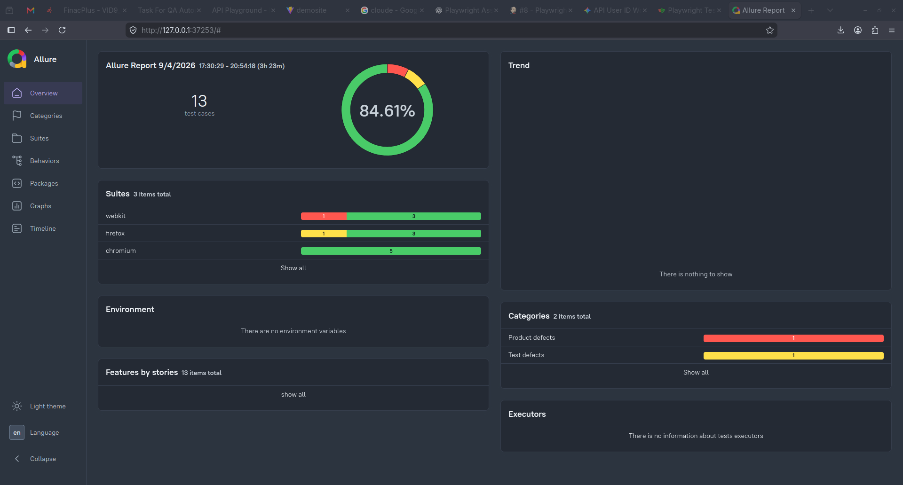
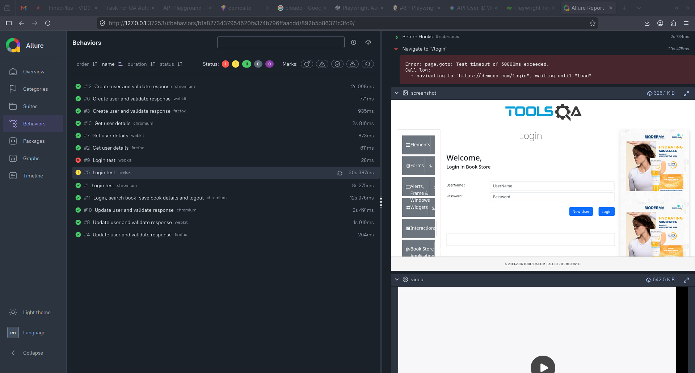
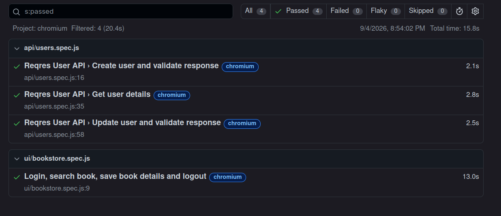
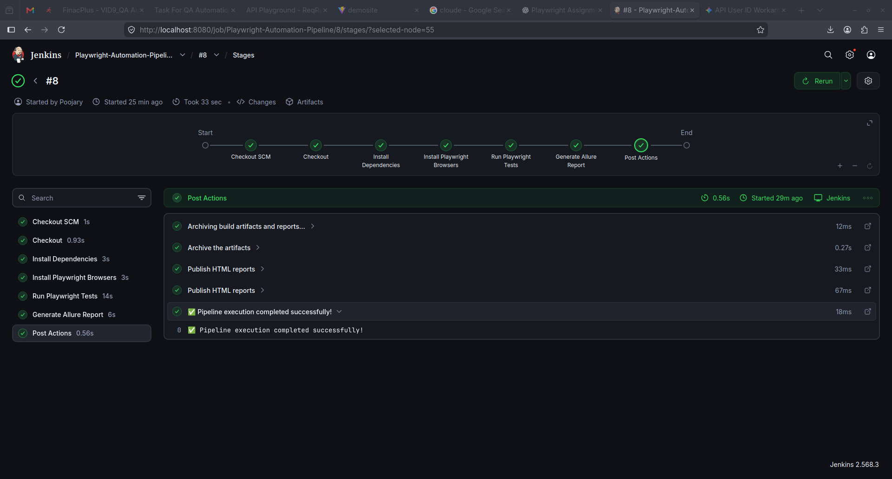

# Playwright UI and API Automation Framework

## Overview

This repository contains an end-to-end (E2E) UI and API test automation framework built using Playwright and JavaScript. The framework is designed following industry best practices, including Page Object Model (POM) architecture for UI automation, a modular API service layer, environment-based configuration management, dual test reporting (Playwright HTML and Allure Reports), and automated CI/CD pipeline integration via Jenkins.

---

## Core Features

- UI Test Automation: Page Object Model (POM) design pattern implemented for DemoQA login and bookstore workflows.
- API Test Automation: Dedicated API client abstraction layer utilizing Playwright APIRequestContext for ReqRes REST API endpoints (POST, GET, PUT).
- Modular Architecture: Clean separation of test specs, page objects, API services, configuration, test data, and output artifacts.
- Environment Management: Multi-environment environment variable support handled via dotenv (.env).
- Rich Test Reporting: Concurrent generation of native Playwright HTML reports and detailed Allure reports.
- CI/CD Automation: Declarative Jenkins pipeline (Jenkinsfile) for automated test execution, report generation, and artifact archiving.
- Data Persistence: Automated extraction and file persistence of test results (book details saved to disk).

---

## Project File Structure

```
finacplus-playwright-assignment/
├── .env                         # Local environment variables configuration file
├── .gitignore                   # Git exclusion rules for node_modules, reports, logs
├── Jenkinsfile                  # Jenkins declarative CI/CD pipeline script
├── package.json                 # Node.js project manifest and dependency definitions
├── package-lock.json            # Dependency lockfile
├── playwright.config.js         # Playwright test runner configuration file
├── api/                         # API Service Layer
│   └── UserApi.js               # ReqRes API client class encapsulating HTTP methods
├── pages/                       # Page Object Model Layer
│   ├── bookstore.page.js        # Locators and interactions for Book Store page
│   └── login.page.js            # Locators and interactions for Login page
├── tests/                       # Test Specification Suites
│   ├── api/
│   │   └── users.spec.js        # API test suite covering user creation, fetch, and update
│   └── ui/
│       └── bookstore.spec.js    # UI test suite covering login, search, extraction, and logout
├── output/                      # Test Execution Artifacts
│   └── book-details.txt         # Extracted book details generated by UI test suite
└── docs/
    └── images/                  # Documentation images and screenshots
        ├── allure-report.png    # Screenshot of custom Allure report dashboard
        ├── html-report.png      # Screenshot of Playwright HTML report dashboard
        └── jenkins-pipeline.png # Screenshot of Jenkins CI/CD pipeline stage execution view
```

### Detailed Component Explanations

1. `pages/login.page.js`: Implements the `LoginPage` class encapsulating UI elements (`usernameInput`, `passwordInput`, `loginButton`, `logoutButton`) and actions (`goto`, `login`, `logout`) for the DemoQA login interface.
2. `pages/bookstore.page.js`: Implements the `BookStorePage` class encapsulating elements (`bookStoreButton`, `searchBox`) and methods (`openBookStore`, `searchBook`, `getBookDetails`) for the DemoQA bookstore interface.
3. `api/UserApi.js`: Implements the `UserApi` class handling API HTTP requests (`createUser`, `getUser`, `updateUser`) against the ReqRes API endpoint, using dynamic environment variables and custom headers.
4. `tests/ui/bookstore.spec.js`: Automated E2E spec performing user login, bookstore navigation, book search ("Learning JavaScript Design Patterns"), detail parsing, output file saving (`output/book-details.txt`), and logout verification.
5. `tests/api/users.spec.js`: API spec suite asserting HTTP 201 on user creation, HTTP 200 on retrieving user details, and HTTP 200 on updating user information.
6. `playwright.config.js`: Central configuration defining test directory (`./tests`), worker count, retry strategy, headless browser mode, screenshot/video capture rules on failure, reporters (List, HTML, Allure), and target base URLs.
7. `Jenkinsfile`: Declarative Jenkins pipeline defining execution stages: Checkout SCM, Install Dependencies, Install Playwright Browsers, Run Playwright Tests, Generate Allure Report, and Post Actions for artifact archiving and report publishing.
8. `.env`: Environment setup file defining `BASE_URL`, `API_URL`, `USERNAME`, `PASSWORD`, and `REQRES_API_KEY`.

---

## Technical Stack

- Test Runner: Playwright (@playwright/test)
- Programming Language: JavaScript (ES Modules / Node.js)
- Design Patterns: Page Object Model (POM), API Service Abstraction
- Assertion Library: Playwright Expect Assertions
- Environment Manager: dotenv
- Reporters: Playwright HTML Reporter, Allure Playwright (@allure-playwright, allure-commandline)
- CI/CD Server: Jenkins (Declarative Pipeline)

---

## Prerequisites

Before running the project, ensure you have the following installed on your system:

- Node.js: Version 16.x or higher
- NPM: Version 8.x or higher
- Java Runtime Environment (JRE): Required for viewing Allure reports locally

---

## Setup and Installation Guide

1. Clone the repository:
   ```bash
   git clone https://github.com/PrajwalGpy/finacplus-playwright-assignment
   cd finacplus-playwright-assignment
   ```

2. Install Node.js dependencies:
   ```bash
   npm install
   ```

3. Install Playwright browser binaries:
   ```bash
   npx playwright install
   ```

4. Configure environment variables:
   Create or verify the `.env` file in the root directory with the following variables:
   ```env
   BASE_URL=https://demoqa.com
   API_URL=https://reqres.in
   USERNAME=your_username
   PASSWORD=your_password
   REQRES_API_KEY=your_optional_api_key
   ```

---

## Test Execution Commands

### Run All Tests
Execute all UI and API tests across the project:
```bash
npm test
```

### Run Tests on Specific Browser
Execute tests specifically on Chromium:
```bash
npm run test:chromium
```

### Run Only UI Tests
Execute UI test specifications:
```bash
npx playwright test tests/ui
```

### Run Only API Tests
Execute API test specifications:
```bash
npx playwright test tests/api
```

### Run Tests in Headed Mode
Watch test execution visually in browser window:
```bash
npx playwright test --headed
```

---

## Reports and Visualizations

### Custom Allure Report

Allure provides an interactive, detailed graphical report of test execution, suite statistics, and duration analytics.

Image Tag for Custom Allure Report:




Generate and open Allure report locally:
```bash
# Generate HTML report from results directory
npm run allure:generate

# Open the generated Allure HTML report in default browser
npm run allure:open

# Alternatively, serve the report directly
npm run allure:serve
```

---

### Playwright HTML Report

Playwright provides a built-in HTML report with step-by-step trace analysis, screenshot attachments, and video recordings of failures.

Image Tag for HTML Report:



View Playwright HTML report locally:
```bash
npx playwright show-report
```

---

## CI/CD Jenkins Pipeline Integration

This project includes a fully automated `Jenkinsfile` for continuous integration and continuous deployment.

Image Tag for CI/CD Jenkins Pipeline:


### Jenkins Pipeline Stages Breakdown

1. Checkout SCM: Clones the latest source code from the repository branch.
2. Install Dependencies: Installs Node.js modules using `npm ci` or `npm install`.
3. Install Playwright Browsers: Downloads and configures Playwright browser binaries (`npx playwright install`).
4. Run Playwright Tests: Executes the automated UI and API test suites via `npm test`.
5. Generate Allure Report: Builds static Allure HTML reports from execution results (`npm run allure:generate`).
6. Post Execution Actions:
   - Archives test artifacts (`playwright-report/**`, `allure-results/**`, `allure-report/**`, `test-results/**`).
   - Publishes Playwright HTML Report link to Jenkins build dashboard.
   - Publishes Allure Report link to Jenkins build dashboard.

---

## Environment Variables Configuration

| Variable Name | Purpose | Example Value |
|---|---|---|
| BASE_URL | Target web application base URL | https://demoqa.com |
| API_URL | Target REST API base URL | https://reqres.in |
| USERNAME | DemoQA application login username | User123 |
| PASSWORD | DemoQA application login password | Pass@123 |
| REQRES_API_KEY | API key for header authentication | optional_key |
